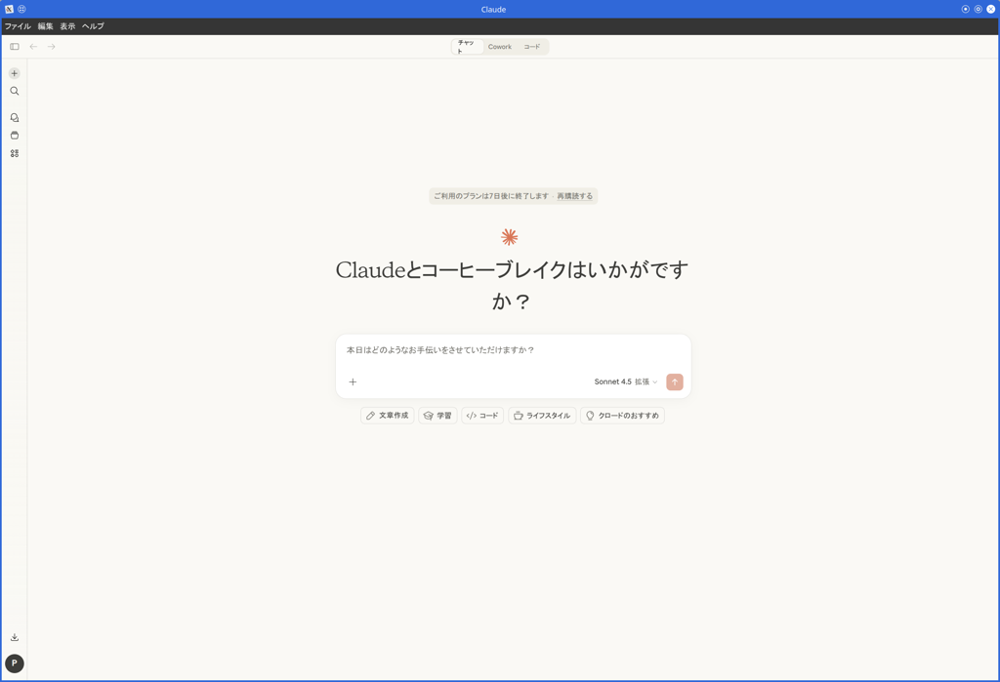

# Claude Desktop for openSUSE/SUSE Linux Enterprise

このプロジェクトは、Claude DesktopをopenSUSEおよびSUSE Linux Enterpriseでネイティブに実行するためのビルドスクリプトを提供します。  
公式のWindowsアプリケーションを再パッケージし、`.rpm`パッケージおよびAppImageを生成します。  

[aaddrick/claude-desktop-debian](https://github.com/aaddrick/claude-desktop-debian)のフォークで、openSUSE/SLEディストリビューション向けに適応されています。  

> **注意:**  
> これは非公式のビルドスクリプトです。公式サポートについては、[Anthropicのウェブサイト](https://www.anthropic.com)をご覧ください。  
> ビルドスクリプトやLinux実装に関する問題については、このリポジトリで[issueを開いて](https://github.com/presire/claude-desktop-suse/issues)ください。  

## 機能

- **ネイティブLinuxサポート**: 仮想化やWineを使わずにClaude Desktopを実行
- **アプリ内Topbar**: WCO shimによるハンバーガーメニュー、サイドバートグル、検索、ナビゲーション（hybridモード）
- **タイトルバースタイル**: 3つのモード — hybrid（デフォルト、OSフレーム + アプリ内Topbar）、native、hidden
- **ウィンドウアイコン**: `BrowserWindow` の `setIcon()` で Claude ロゴを設定し、X11 のウィンドウマネージャ（KWin など）がタイトルバー / Alt-Tab / タスクバーに Electron デフォルトの atom グリフではなくアプリアイコンを描画
- **Close-to-tray**: ウィンドウを閉じるとトレイに最小化、MCPサーバーやスケジューラを維持
- **スタートアップ起動**: 「起動時に実行」設定トグルのXDG Autostart連携
- **インプレースアップグレード検知**: 起動中に `zypper up` で `app.asar` が置き換えられた場合、Claude Desktopは「クリックして再起動」通知を表示。v(N+1) の HTML が v(N) の IPC で動く事故を防止
- **KDE Plasma Wayland ランチャーグルーピング**: パッケージされた `app.asar` 内に `pkg.desktopName` を設定することで、KDE Plasma が Claude Desktop ウィンドウをインストール済みの `.desktop` ファイルと同じグループにまとめる（Wayland のタスクバーで分離表示される問題を修正）
- **トレイアイコンのテーマ切替**: `nativeTheme` 更新時に `setImage` + `setContextMenu` のインプレース fast-path を使うことで、KDE Plasma での重複 SNI 登録レースを回避
- **MCPサポート**: Model Context Protocolの完全統合
  設定ファイルの場所: `~/.config/Claude/claude_desktop_config.json`
- **Coworkモード**: プラガブルな分離バックエンド（bubblewrap / host）と自動検出、ユーザー選択フォルダの sharedCwdPath 転送、cooldown 付きデーモン自動再起動、ホスト/サンドボックスで異なるパスをマウントする `{src, dst}` 形式に対応
- **診断機能**: `claude-desktop --doctor` による包括的ヘルスチェック（ディスプレイサーバー、サンドボックス権限、MCP 設定、stale ロック、IBus/GTK 入力メソッド、cowork バックエンドの状態）
- **システム統合**:
  - グローバルホットキーサポート（Ctrl+Alt+Space） - X11およびWayland（XWayland経由）で動作
  - システムトレイ統合（close-to-tray永続化対応）
  - デスクトップ環境統合
  - Quick Window の blur/visibility パッチを KDE 限定にゲート（GNOME での回帰を回避）

### スクリーンショット

<p align="center">
  
</p>

<p align="center">
  
</p>

## インストール

### ソースからのビルド

詳細なビルド手順、技術的な詳細、手動アップデート方法については [docs/BUILDING.md](docs/BUILDING.md) を参照してください。  

#### 前提条件

ビルド前に必要なパッケージをインストールしてください:  

```bash
sudo zypper install git gcc-c++ make
```

> **注意:**  
> node-ptyネイティブモジュール（Claude Codeターミナル機能用）のビルドには**Python 3.8以降**が必要です。  
> システムのデフォルトPythonが古い場合（例: openSUSE Leap 15.xのPython 3.6）、node-ptyのコンパイルは失敗します。  
> Claude Desktop自体はビルド・動作しますが、Claude Codeターミナル機能は利用できません。  
> Python 3.8+のパス指定方法については [docs/BUILDING.md](docs/BUILDING.md) を参照してください。  

#### ビルドとインストール

```bash
# リポジトリのクローン
git clone https://github.com/presire/claude-desktop-suse.git
cd claude-desktop-suse

# RPMパッケージのビルド（デフォルト）
./build.sh

# AppImageのビルド
./build.sh --build appimage

# ダークモードトレイアイコンでビルド（暗いパネル向けの白アイコン）
./build.sh --dark

# パッケージのインストール
sudo zypper install ./claude-desktop-VERSION-ARCHITECTURE.rpm
```

ビルドスクリプトが残りの依存関係（`p7zip`, `wget`, `icoutils`, `ImageMagick`, `rpm-build`）をzypper経由で自動インストールします。  
Node.js 20+は未インストールの場合、ローカルに自動ダウンロードされます。  

### ビルド済みリリースの利用

[リリースページ](https://github.com/presire/claude-desktop-suse/releases)から最新の`.rpm`または`.AppImage`をダウンロードできます。  

## 設定

Model Context Protocolの設定は以下に保存されます:  

```
~/.config/Claude/claude_desktop_config.json
```

環境変数、Waylandサポート、Coworkサンドボックスマウントなどの追加設定については [docs/CONFIGURATION.md](docs/CONFIGURATION.md) を参照してください。  

## トラブルシューティング

`claude-desktop --doctor` を実行すると、よくある問題を自動診断できます。（ディスプレイサーバ、サンドボックス権限、MCP設定、staleロック等）  
Coworkモードの準備状況 — 使用されるバックエンドと、不足している依存関係も確認できます。  

追加のトラブルシューティング、アンインストール手順、ログの場所については [docs/TROUBLESHOOTING.md](docs/TROUBLESHOOTING.md) を参照してください。  

## ディストリビューションサポート

### テスト済みディストリビューション

- openSUSE Leap 15.5以降
- openSUSE Tumbleweed
- SUSE Linux Enterprise 15 SP5以降

## 謝辞

このフォークは[aaddrick/claude-desktop-debian](https://github.com/aaddrick/claude-desktop-debian)をベースにしています。  

元のプロジェクトは、[k3d3のclaude-desktop-linux-flake](https://github.com/k3d3/claude-desktop-linux-flake)と、LinuxでClaude Desktopをネイティブに実行することについての[Reddit投稿](https://www.reddit.com/r/ClaudeAI/comments/1hgsmpq/i_successfully_ran_claude_desktop_natively_on/)にインスパイアされました。  

特別な感謝:  

- **aaddrick** - 元のDebianビルドスクリプト
- **k3d3** - 元のNixOS実装とネイティブバインディングの洞察
- **[emsi](https://github.com/emsi/claude-desktop)** - タイトルバー修正と代替実装アプローチ
- **[leobuskin](https://github.com/leobuskin/unofficial-claude-desktop-linux)** - PlaywrightベースのURL解決アプローチ
- **[yarikoptic](https://github.com/yarikoptic)** - codespellサポートとshellcheck準拠
- **[IamGianluca](https://github.com/IamGianluca)** - ビルド依存関係チェックの改善
- **[ing03201](https://github.com/ing03201)** - IBus/Fcitx5入力メソッドサポート
- **[ajescudero](https://github.com/ajescudero)** - Node互換性のための@electron/asarピン留め
- **[delorenj](https://github.com/delorenj)** - Wayland互換性サポート
- **[Regen-forest](https://github.com/Regen-forest)** - Gear LeverをAppImageLauncher代替として提案
- **[niekvugteveen](https://github.com/niekvugteveen)** - Debianパッケージング権限の修正
- **[speleoalex](https://github.com/speleoalex)** - ネイティブウィンドウ装飾サポート
- **[imaginalnika](https://github.com/imaginalnika)** - ログを`~/.cache/`へ移動
- **[richardspicer](https://github.com/richardspicer)** - Linux上のメニューバー表示修正
- **[jacobfrantz1](https://github.com/jacobfrantz1)** - Claude Desktopコードプレビューサポートとクイックウィンドウ送信修正
- **[janfrederik](https://github.com/janfrederik)** - ローカルインストーラを使用するための`--exe`フラグ
- **[MrEdwards007](https://github.com/MrEdwards007)** - OAuthトークンキャッシュ修正の発見
- **[lizthegrey](https://github.com/lizthegrey)** - バージョン更新への貢献
- **[mathys-lopinto](https://github.com/mathys-lopinto)** - AURパッケージと自動デプロイ
- **[pkuijpers](https://github.com/pkuijpers)** - RPMリポジトリGPG署名問題の根本原因分析
- **[dlepold](https://github.com/dlepold)** - トレイアイコン変数名バグの特定と修正
- **[Voork1144](https://github.com/Voork1144)** - トレイアイコンミニファイアバグの詳細分析、Chromiumレイアウトキャッシュバグの根本原因分析、直接子`setBounds()`修正アプローチ
- **[sabiut](https://github.com/sabiut)** - `--doctor`診断コマンド、ダウンロード用SHA-256チェックサム検証、deb/rpm/AppImageアーティファクトのビルド後統合テスト
- **[milog1994](https://github.com/milog1994)** - ポップアップ検出、機能スタブ、Waylandコンポジタサポートを含むLinux UX改善
- **[jarrodcolburn](https://github.com/jarrodcolburn)** - コンテナ/CI環境でのパスワードレスsudoサポート、gh-pages 4GB肥大化修正の特定、Debianでのvirtiofsdパス検出問題の特定、CIリリースパイプライン障害の詳細分析、session-startフックのsudoブロッキング問題の診断
- **[chukfinley](https://github.com/chukfinley)** - LinuxでのCoworkモードサポート
- **[CyPack](https://github.com/CyPack)** - 起動時の孤立したcoworkデーモンクリーンアップ
- **[IliyaBrook](https://github.com/IliyaBrook)** - Claude Desktop >= 1.1.3541 arm64リファクタのプラットフォームパッチ修正
- **[MichaelMKenny](https://github.com/MichaelMKenny)** - `$`プレフィックス付きelectron変数バグの診断と回避策
- **[daa25209](https://github.com/daa25209)** - coworkプラットフォームゲートクラッシュの詳細な根本原因分析とパッチスクリプト
- **[noctuum](https://github.com/noctuum)** - 設定可能なメニューバー表示とブール別名サポート付き`CLAUDE_MENU_BAR`環境変数
- **[typedrat](https://github.com/typedrat)** - build.sh、node-pty derivation、CI自動更新を統合したNixOSフレーク、フレークパッケージスコーピングリグレッションの修正
- **[cbonnissent](https://github.com/cbonnissent)** - Cowork VMゲストRPCプロトコルのリバースエンジニアリング、KVM起動ブロッカーの修正、永続接続向けRPCレスポンスIDエコーイングの修正、専用Linux設定ファイルによる設定可能なbwrapマウントポイント
- **[joekale-pp](https://github.com/joekale-pp)** - RPMランチャーへの`--doctor`サポート追加
- **[ecrevisseMiroir](https://github.com/ecrevisseMiroir)** - tmpfsベースの最小ルートを使用したbwrapバックエンドサンドボックス分離
- **[arauhala](https://github.com/arauhala)** - NixOS `isPackaged`リグレッションの詳細な根本原因分析
- **[cromagnone](https://github.com/cromagnone)** - 初期トリアージを覆す詳細なログによるbwrapインストール上のVMダウンロードループ確認
- **[aHk-coder](https://github.com/aHk-coder)** - cowork smol-binパッチでのハードコード化されたミニファイ変数クラッシュの診断
- **[RayCharlizard](https://github.com/RayCharlizard)** - 自己参照`.mcpb-cache` symlink ELOOPバグの詳細分析、HostBackendでの自動メモリパス変換の修正
- **[reinthal](https://github.com/reinthal)** - nixpkgsの`nodePackages`削除によるNixOSビルドブレークの修正
- **[gianluca-peri](https://github.com/gianluca-peri)** - GNOMEの終了アクセシビリティ問題の報告とAppIndicatorでのトレイ動作の確認
- **[martin152](https://github.com/martin152)** - ランチャークリーンアップの3つのバグの詳細診断と完全なパッチ
- **[hfyeh](https://github.com/hfyeh)** - Ubuntu 24.04 AppArmor非特権ユーザー名前空間ブロックのCowork bwrapでの診断とAppArmorプロファイル回避策の提供
- **[davidamacey](https://github.com/davidamacey)** - リモートデスクトップセッションでのXRDP GPU合成による白画面問題の特定と修正
- **[pb3ck](https://github.com/pb3ck)** - Cowork `CLAUDE_CODE_OAUTH_TOKEN`環境変数ストリップバグの診断
- **[aJV99](https://github.com/aJV99)** - ネイティブWaylandモードでの`GDK_BACKEND=wayland`エクスポートによるHiDPIディスプレイでのXWaylandフォールバックぼやけの修正
- **[Andrej730](https://github.com/Andrej730)** - quick-window 正規表現の可読性改善（`String.raw` + `escapeRegExp` ヘルパー）と、Claude Desktop 1.3883.0 における visibility 関数 regex の破綻修正
- **[Joost-Maker](https://github.com/Joost-Maker)** - Claude Desktop 1.3109.0 での cowork Patch 9 における `$e` fs 参照クラッシュの修正（`[$\w]+` 識別子捕捉パターンの導入）
- **[HumboldtJoker](https://github.com/HumboldtJoker)** - Claude Desktop 1.5354.0 における cowork Patch 2b のサイレント失敗の診断（ログ行はパッチされていたが、セッション初期化が依然として Swift addon 経由でルーティングされていたことを特定）
- **[zabka](https://github.com/zabka)** - Linux で `cowork-vm-service.js` が自動起動されていなかった問題の特定と、systemd-unit 回避策の提供（デーモン自動起動修正のスコープ確定）
- **[sirfaber](https://github.com/sirfaber)** - Claude Desktop 1.5354.0 における cowork Patch 2b（vm モジュール代入）と Patch 6 step 2（リトライ遅延の自動起動）の `$` 含む難読化識別子による破綻の修正
- **[ProfFlow](https://github.com/ProfFlow)** - RPM repodata 署名のリグレッション再修正（`gpg --default-key` に渡す keyid に `!` を付与し、`repomd.xml` を主鍵で署名するよう強制）
- **[jslatten](https://github.com/jslatten)** - パッケージされた `app.asar` の `package.json` に `pkg.desktopName` を設定することで、KDE Plasma Wayland のランチャーグルーピングバグを修正

NixOSユーザーの方は、Nix固有の実装について[k3d3のリポジトリ](https://github.com/k3d3/claude-desktop-linux-flake)を参照してください。  

## ライセンス

このリポジトリのビルドスクリプトは、以下のデュアルライセンスの下でライセンスされています:  

- MITライセンス（[LICENSE-MIT](LICENSE-MIT)を参照）
- Apache License 2.0（[LICENSE-APACHE](LICENSE-APACHE)を参照）

Claude Desktopアプリケーション自体は、[Anthropicの消費者向け利用規約](https://www.anthropic.com/legal/consumer-terms)の対象となります。  

## 貢献

貢献を歓迎します！貢献を提出することにより、このプロジェクトと同じデュアルライセンス条件の下でライセンスすることに同意したものとみなされます。  

元のDebianビルドスクリプトに関連する貢献については、[上流のリポジトリ](https://github.com/aaddrick/claude-desktop-debian)への貢献もご検討ください。  
